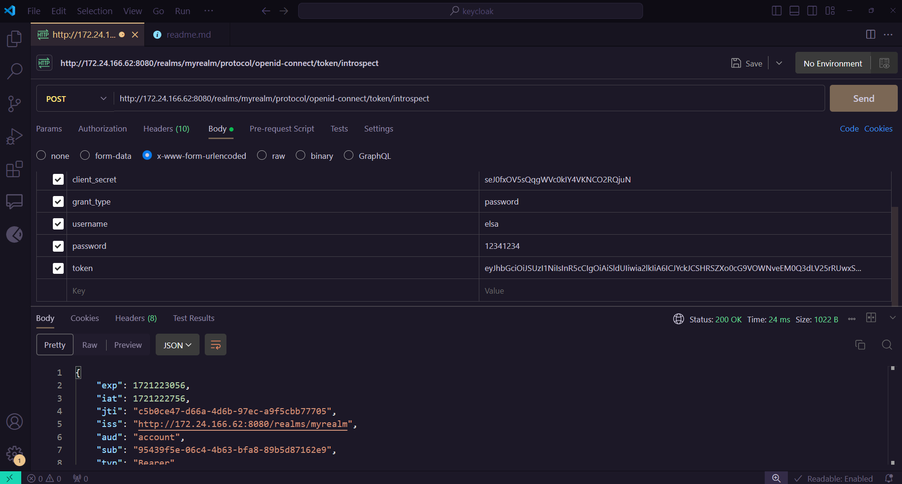

# Install keycloak
- I was trying to install keycloak locally but because windows is trash the port was not getting overrided by some reason
- With this in mind i created a yaml file for the keycloak
# Configure Keycloak for rest api connections
## 1. Creating a realm
- Left upper menu
- We have a page where we can apply a "Resource file" so everyone can have the same configuration but ignore it
- Create a name for it
- Im creating a realm called "myrealm"
## 2. Create a client
- A client is a app that uses keycloak
- Put the name and etc, go next and in the capability config menu you should enable client authentication
- For rest requests we need only the client authentication
- I will put "http://172.24.166.62:8080/*" in valid redirect uris
- Web origins is the websites that should be allowed to access the keycloak
## 3. Create a user
- Create a user, put the name and etc
- After we must set the password and thats it
- It will get a default role
- We must set a email for it to work
## 4. make a token request

## 5. Introspect token

- This token is the one we got in the get token api
## 6. Logout

- This is for logout
## 7. Refresh Token

# Applying this to a actual application
- We created a basic application in the quarkus 
- In this app we used annotations that only allow admins to make certain operations and in other we dont have roles
- To make it work now we must enable authorization in our client (in our case is quarkus-be)
- Now in the authorization section we enable all resources with /*

- We create a policy that uses the roles that we wish to use like admin 

- Then we create a permision that uses the resource policy that we created and the role policie that we created

# Final statement
- Like this we have all the materials to construct a effectively login using keycloak
- The rest is having knowledge of proper configs but the fundamental is here